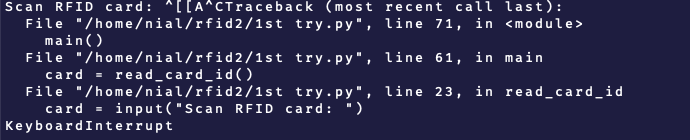
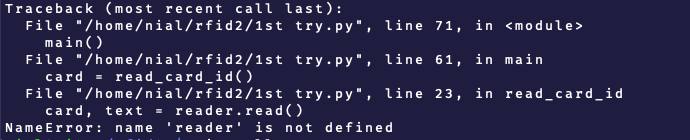
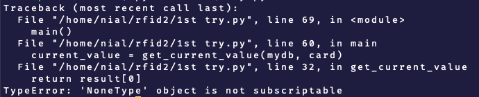

Using

([https://github.com/nmcc1212/rfid2/blob/d627b2f2af4d4ee86963e30932556b7870d28e62/1st%20try.py](https://github.com/nmcc1212/rfid2/blob/d627b2f2af4d4ee86963e30932556b7870d28e62/1st%20try.py))
for reading cards didn't work, now using SimpleMFRC522

\-\--

Then created the SQL table using the code in [sqlcode.sql](<sqlcode.sql>)

\-\--



A reader object was missing

\-\--



Didn't handle error if the RFID UID was not in the database, fix

```
if result:
	return result\[0\]
else:
	return None
```


\-\--


The GPIO pins showed as still in use after closing and relaunching the
program fixed by adding the "atexit" library which runs a predefined
script (GPIO.cleanup) when the program exits

\-\--


It looks as if the script works even though the card is not in the
database, fixed by checking if None is returned, if it is printing an
Error and then exiting


\-\--

Now I added the RFID card to the DB manually, using the following SQL command

`INSERT INTO rfid2.card_states (card_id, binary_value, timestamp) VALUES (770381256117, 0, \"2023-01-01 00:00:00\");`

\-\--

Imgs of working 2nd iteration (adding users manually )


The card has just been added


The card has been tapped


This is now reflected in the database

Again, the card has been tapped

Again, reflected in the database
