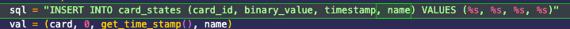

## Add new card function

Add function for adding new cards to the database


Instead of exit() instead, we now call the add_new_card() function

\--

## Add support for Names

Add to database
```
ALTER TABLE card_states

ADD COLUMN name VARCHAR(255);
```

Add another %s to the add_new_cards() functrion


\--

## Name missing in SQL INSERT


Didn't add names to the sql insert command


Now becomes



\--

## New get name function


The script did not get the name from the database, meaning when the script tried to print the name it didn't know it. This only occurred for when the add_new_card() function was not used, as if it was the name would have been provided then

I created a new function get_name() to get the name from the database


Then I changed the IF statement that is used to determine if the user is in the database or not. Now if the user is already in the database the new get_name() function is called, if the user is not in the database, the add_new_card() function is called, which asks for the name already


\-\--

Final work

The database is empty


Now the card is scanned


This can now be seen in the database


Now the same card is scanned again


