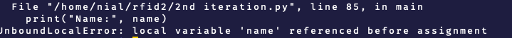

## Add new card function

Add function for adding new cards to the database


Instead of exit() instead, we now call the add_new_card() function

\-\--

## Add support for Names

To add another column to the database for the name of the user I used to SQL code below
```
ALTER TABLE card_states

ADD COLUMN name VARCHAR(255);
```

Add another %s to the add_new_cards() function, this allows for another input, the new name variable


\-\--

## Name missing in SQL INSERT


Didn't add names to the sql insert command, this meant that the script would provide 4 variables (inlcudeing the name) but the SQL INSERT would only accept 3 as name was not defined


Now becomes


\-\--

## New get name function



The script did not get the name from the database, meaning when the script tried to print the name it didn't know it. This only occurred for when the add_new_card() function was not used, as if it was the name would have been provided and stored when add_new_card was run

I created a new function get_name() to get the name from the database


Then I changed the IF statement that is used to determine if the user is in the database or not. Now if the user is already in the database the new get_name() function is called, if the user is not in the database, the add_new_card() function is called, which asks for the name already


\-\--

## Working code

The database is empty


Now the card is scanned, as it is not in the database, the add_new_card() function runs, which then asks for the name of the user then adds that and the RFID UID to the database


This can now be seen in the database


Now the same card is scanned again


