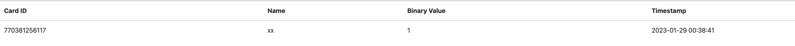

To create the web interface I am using Flask, a web framework written in
python. (<https://en.wikipedia.org/wiki/Flask_(web_framework)>)

\--

## Use subfolder template for the HTML files

{width="6.268055555555556in"
height="1.7586209536307962in"}

The template index.html could not be found, this is because index.html
was placed in the same folder as the python script whereas it should
have been in the folder called templates

\--

## Change host address

The site can only be accessed from the pi but not over the network,
fixed by adding a bind address of 0.0.0.0,
(<https://github.com/flutter/flutter/issues/32629#issuecomment-492176223>)

{width="4.361111111111111in"
height="0.9027777777777778in"}

\--

At this point the site did work, as shown below but I wanted to improve
the look of the site

{width="5.160919728783902in"
height="1.5862062554680665in"}

To do this I added bootstrap, jQuerry and Popper

{width="8.26826334208224in"
height="0.4827580927384077in"}First I created a table to layout the data
in a more visually appealing way, this can be seen below

Then I added a homepage and navigation bar to the page, as seen below
