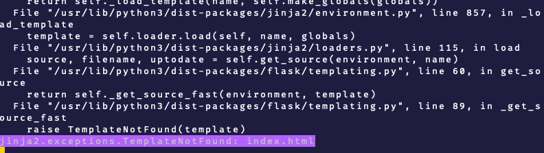
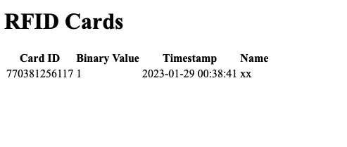

To create the web interface I am using Flask, a web framework written in
python. (<https://en.wikipedia.org/wiki/Flask_(web_framework)>)

\-\--

## Use subfolder template for the HTML files

The template that holds the HTML file containing the structure for the website "index.html" could not be found, this is because index.html was placed in the same folder as the python script whereas it should have been in the folder called templates

\-\--

## Change host address

The site can only be accessed from the pi but not over the network, fixed by adding a bind address of 0.0.0.0,
(<https://github.com/flutter/flutter/issues/32629#issuecomment-492176223>)

\-\--
## Improving the looks

At this point the site did work, as shown below but I wanted to improve the look of the site

To do this I added bootstrap, jQuerry and Popper, these are CSS/JS libraries containing elements such as buttons, navbars and tables

First I created a table to layout the data
in a more visually appealing way, this can be seen below

Then I added a homepage and navigation bar to the page, as seen below
